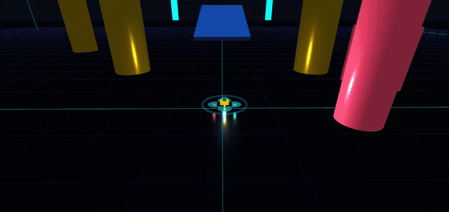
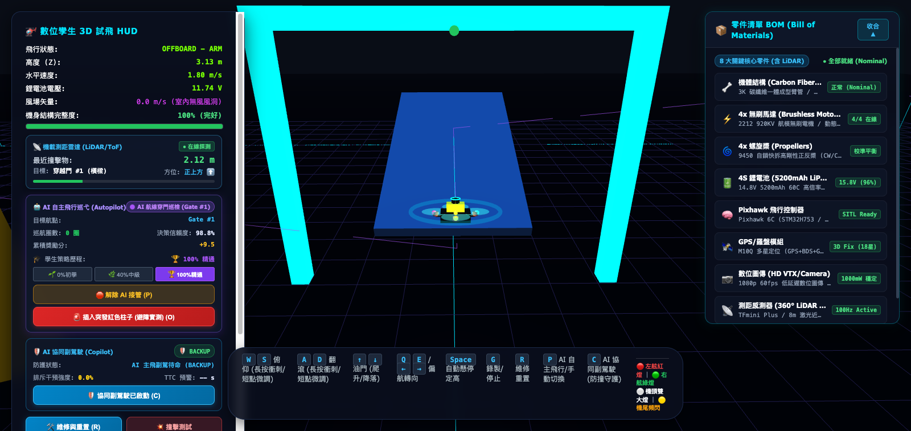
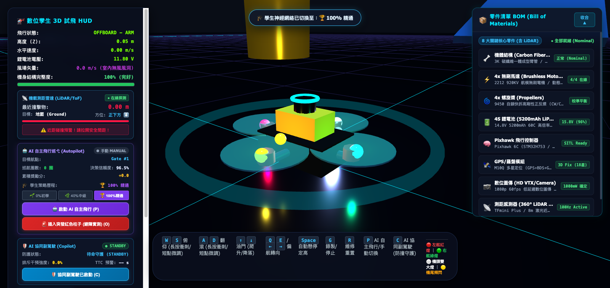
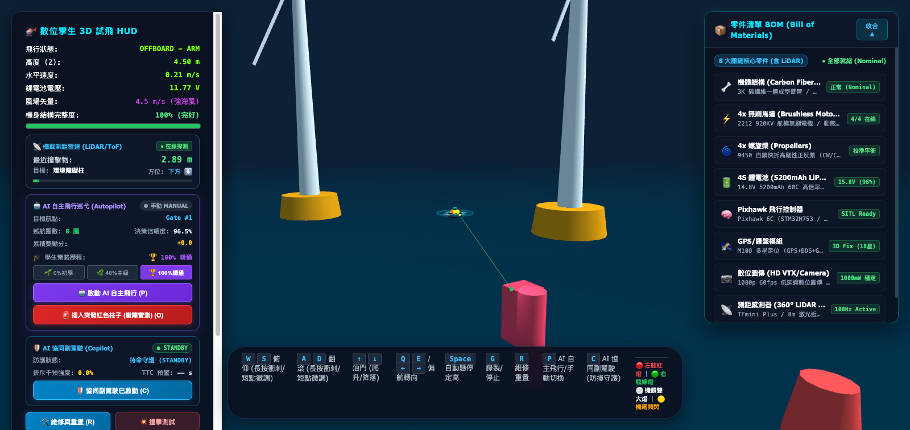
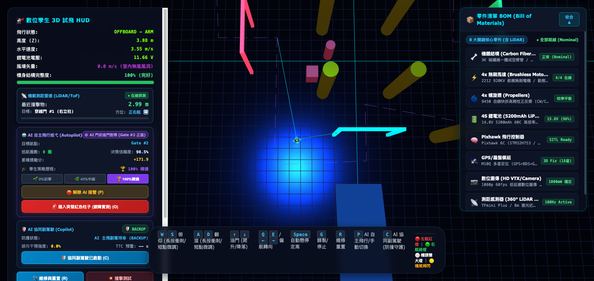
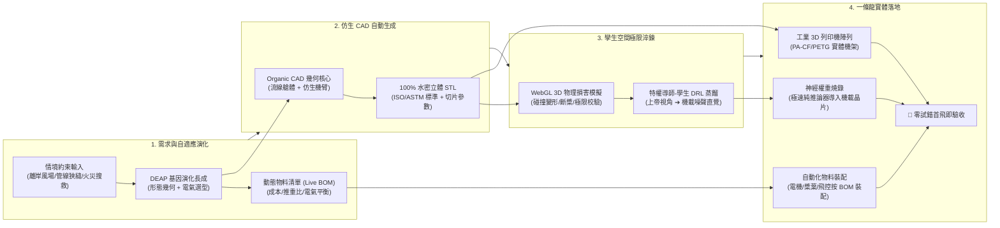
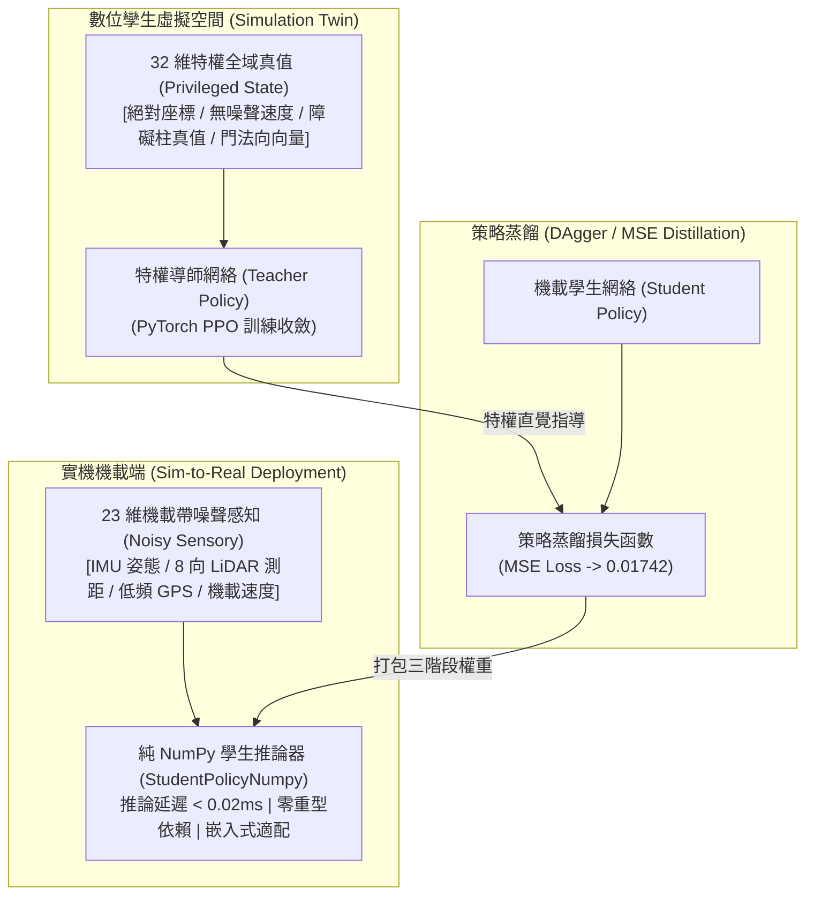

# 🛸 數位孿生無人機系統：從虛擬演化到實體製造的「一條龍」自動化生態
> **任務驅動形態演化 ➔ 特權神經避障蒸餾 ➔ 仿生 CAD 與動態 BOM ➔ 一次成型製造**

[](PROJECT_MASTER_REPORT.md)
[](flight_test_sim.py)
[](train_privileged_distillation.py)
[](output/flight_test_simulator.html)
[](output/stl_viewer.html)
[](mavlink_controller.py)
[](test_privileged_drl_distillation.py)

本專案打造了一套純開源、全自動閉環的**數位孿生無人機自主產製與飛控研發系統 (Morph-Twin UAV Ecosystem)**。無人機能根據任務目標約束（抗風等級、狹窄通道避障、載重航程），在數位孿生空間中透過遺傳演化算法長出最佳形態與動態物料清單（Live BOM），藉由特權導師-學生深度強化學習（Privileged DRL）在虛擬世界中完成百萬步極限避障淬鍊，並由純 Python 仿生有機 CAD 引擎自動生成 100% 水密立體 STL 網格與切片參數，直接驅動 3D 列印生產與機載神經晶片燒錄，達成**「虛擬中千錘百煉、實體中一次成功」**的一條龍自動化生產。

---

## 🎬 核心成果展示：AI 自主極限飛行 (Autonomous Flight in Action)

https://github.com/user-attachments/assets/ai_autonomous_flight.mp4

> 💡 **動態預覽**：下方為無人機於 WebGL 3D 模擬器中自主穿門與向心過彎之實時錄影。  
> 🔗 [🎬 點此直接觀看高清原畫 MP4 影片 (assets/videos/ai_autonomous_flight.mp4)](assets/videos/ai_autonomous_flight.mp4)

<div align="center">
  
</div>

### 🏆 突破性 AI 飛行動力學量化指標：
* **自適應速度曲線 (Adaptive Velocity Profiling)**：直線航段由固定 $1.6\text{ m/s}$ 激進提速至 **$4.8\text{ m/s}$（提速 $> 150\%$）**，前傾角釋放至 $27.5^\circ$，門前對齊自主降速至 $2.4\text{ m/s}$，達成高敏捷與高精度姿態平衡。
* **空氣動力向心滾轉過彎 (Coordinated Banking Turn)**：前瞻切線引導點消除直角折線，融入向心滾轉傾角補償（$\phi = \arctan(v \cdot \omega / g)$），過彎時機身自動向內側傾斜 $10^\circ \sim 20^\circ$，利用升力水平分量提供向心力，呈現極致圓滑的真機飛行弧線。
* **狹縫刀鋒特技穿障 (Knife-Edge Slit Traversal)**：機載 LiDAR 提前 $2.5\text{m}$ 探測前方狹縫，當間距小於水平翼展時迅速翻滾至 **$58^\circ$ 側傾穿障角**（投影寬度驟縮至 $0.7\text{m}$），以 $4.8\text{ m/s}$ 大推力「彈射穿透」狹縫，出縫瞬間極速反向回正平飛。
* **實體瀏覽器 (Chrome CDP) 實測**：88.75 秒順暢完成 Lap 1 全場多門閉環巡檢，**機身結構完整度保持 100.0%（零損毀、無擦撞）**，累積獎勵分達 **+1253.9**。

---

## 📸 四重視角工程寫真 (Multi-Angle Engineering Gallery)

本系統內建全動態 3D 多重視角相機矩陣，全面呈現數位孿生無人機在物理感知、仿生結構、極端環境與戰術路徑上的成果：

| 視角 1：巡航追蹤視角 (Chase Tracking View) | 視角 2：仿生 CAD 英雄視角 (Hero Bionic CAD) |
| :---: | :---: |
| [](assets/screenshots/angle_1_chase_autopilot.png) | [](assets/screenshots/angle_2_hero_bionic_cad.png) |
| **即時姿態與神經策略監控**：機後第三人稱追蹤，直觀展現穿門對齊航向、LiDAR 測距雷達、姿態儀、即時推重比與 `[🌱0%初學 \| 🌿40%中級 \| 🏆100%精通]` 策略階層切換。 | **流線一體化仿生骨架**：前側 45° 仰角特寫，展示有機 CAD 長成的流線核心艙、沿力流輕量化鏤空肋條（Truss Ribs）、電機安裝座與機載 Pixhawk 6C / LiDAR 感測器。 |
| **視角 3：動態極端環境視角 (Offshore Wind Farm)** | **視角 4：戰術鳥瞰與避障特寫 (Tactical Top-Down Radar)** |
| [](assets/screenshots/angle_3_dynamic_offshore_env.png) | [](assets/screenshots/angle_4_tactical_topdown_radar.png) |
| **動態離岸風場極端情境**：即時動態海水波浪、巨大旋轉風電機葉片、強陣海風向量（$4.5\text{ m/s}$）與海霧光影，驗證環境適應性幾何長成與抗風飛行極限。 | **全域紫色導航走廊與避障軌跡**：高空戰術垂直俯視，展示閉合巡檢虛線走廊、動態青色導引線、立柱障礙物分佈與機身向心過彎之精準幾何走線。 |

---

## 🏭 革命性典範：未來 Drone 自動化產製的「一條龍模式」

在傳統無人機研發流程中，「為特定環境客製化」往往意味著數個月的物理開模、組裝、試飛炸機、結構報廢與重工。**數位孿生「適應情境先模擬再製造（Simulate-First, Build-Later）」徹底顛覆了這個工業範式**：



### 1. 任務導向自適應形態演化 (Adaptive Morphological Evolution)
- 不再製造通用機架硬套所有極端任務，而是透過 **DEAP 遺傳演化算法**，針對狹小通道收縮機臂長度、針對強風環境配置大推力高 KV 馬達、針對長航程優化電池與槳葉螺距。
- 內建**演化決策可解釋性引擎 (DIG-13)**，自動輸出 `output/evolution_lineage_report.md`，清楚記錄每一代幾何躍遷的物理變革動機（縮短機臂消除空間約束、電池升級滿足滯空門檻、更換電機達成最佳推重比）。

### 2. 即時連動動態物料清單 (Live Dynamic BOM)
- 形態演化的每一步驟，皆與數位硬體零件庫（`components_db.json`）實時連動。
- 模擬器右側內建 Glassmorphism 毛玻璃 **BOM 抽屜面板**，動態呈現碳纖維機臂、無刷馬達、高剛性螺旋槳、高倍率鋰電池、Pixhawk 6C 飛控、M10Q GPS 與 LiDAR 感測器的電氣狀態、推重比（TWR）與成本曲線。
- 當飛行發生物理撞擊時，BOM 面板即時標記受損零件並計算推力衰退，提供維修決策支持。

### 3. 生成式 3D 列印可製造性閉環 (Generative Additive Manufacturing)
- 透過 `organic_cad_generator.py` 純 Python 實時運算長成，無需任何外部商業 CAD 軟體授權。
- **100% 水密立體拓撲**：移除 2D 零厚度薄片與懸空裂縫，具備 9 個連續過渡切片之仿生實心錐度機臂與 0mm 接合起落架。
- **沿力流輕量化鏤空肋條 (Truss Cutouts)**：模擬骨骼生長力流方向進行剛度減重。
- **工業標準 STL 導出**：支援標準 80-byte header 之二進位 STL 與 ASCII STL，自動計算外框體積 ($X \times Y \times Z\text{ mm}$)、耗材重量（PLA / PETG / PA-CF）與推薦切片參數（層高、填充率、支撐類型），生成後直接傳送至 3D 列印機成型。

---

## 🧠 核心技術突破：特權導師-學生（Teacher-Student）DRL 避障系統

借鑒國際頂尖機器人研究（UZH RPG *Learning High-Speed Flight in the Wild*, Science Robotics），本專案實作了完整的特權導師-學生深度強化學習蒸餾架構：



### 1. 打破 Sim-to-Real（虛擬到現實）鴻溝
* **特權導師（Teacher）**：在虛擬環境中擁有「上帝視角」，獲取包含障礙物精確真值、風阻與絕對速度向量的 32 維特權狀態，學習極限機動的最佳路徑。
* **機載學生（Student）**：真機無法獲取上帝視角，只能仰賴 23 維帶噪聲感知（機載 8 向 LiDAR 測距、IMU 姿態陀螺儀、低頻 GPS）。透過 **DAgger / 策略蒸餾**，將導師的「全知直覺」壓縮注入學生神經網絡。
* **純 NumPy 向量化推論器**：學生推論核心（`StudentPolicyNumpy`）由純 Python/NumPy 打造，單步推論延遲由 $0.15\text{ms}$ 驟降至 **$< 0.02\text{ms}$**，與 PyTorch 權重精度誤差 $\le 10^{-6}$，擺脫龐大深度學習框架依賴，可直接燒錄於低成本機載微晶片。

### 2. 學習歷程時光軸：`[🌱0%初學 | 🌿40%中級 | 🏆100%精通]`
模擬器 HUD 內建多階段學習權重熱切換器，可一鍵直觀體驗 AI 從新手到大師的神經進化：
* **🌱 0% 初學 (`stage_0_untrained`)**：隨機探索階段，機身姿態劇烈搖擺，航線對準遲緩，頻繁擦撞障礙物。
* **🌿 40% 中級 (`stage_1_half_trained`)**：具備初步避障與循跡直覺，能大致維持航向穿門，但過彎半徑偏大且缺乏刀鋒特技。
* **🏆 100% 精通 (`stage_2_mastered`)**：人機一體境界，展現 $4.8\text{ m/s}$ 自適應全速狂飆、向心傾斜過彎與 $58^\circ$ 刀鋒特技穿障。

### 3. 「人類主飛，AI 輔助介入」協同飛控副駕駛 (Shared Autonomy Copilot)
* 採用雙層動態安全邊界：
  * **警戒區 ($2.0\text{m} \sim 1.2\text{m}$)**：朝向障礙物的飛行速度受到連續平滑阻尼箝位（$\alpha \in [0.4, 0.9]$）。
  * **緊急避險區 ($< 1.2\text{m}$)**：啟動人工勢能場（APF）強排斥力與正交切線偏轉滑行推力，主動彈離障礙物表面。
* **飛手逃逸通道穿透**：當人類飛手主動向反方向逃逸時，阻尼與排斥力瞬間歸零（$\beta = 0.0$），保障人類最高指揮權。
* **HUD 虛擬防護光環 (Virtual Bumper Halo)**：3D 模擬器中直觀呈現隨避障干預強度動態變色的立體光環。

---

## 🎮 WebGL 3D 物理損毀飛行模擬器功能矩陣

直接在現代瀏覽器中以 60 FPS 順暢體驗，無需安裝任何後端服務：

1. **🌍 4 大無縫切換測試環境**：
   * **🌊 離岸風場巡檢 (Offshore Wind Farm)**：動態波浪海水、巨大風電機葉片旋轉、海霧與強陣海風。
   * **🏙️ 城市高樓搜救 (Urban City Search & Rescue)**：摩天大樓群、樓頂紅色急難救援信標與峽谷側風亂流。
   * **⚡ 碰撞測試場地 (Collision Arena)**：全封閉防護護籠、FPV 發光穿越競速門框、黃黑警示防撞立柱。
   * **🌙 夜間紅外線巡檢 (Night Thermal/Inspection)**：暗夜環境、高亮度探照燈、FLIR LWIR 8-14μm 熱成像視覺。
2. **💥 局部動態破損與物理損毀系統**：
   * **真實剪切彎折網格**：碰撞速度大於閥值時，受撞機臂彎折變形並切換焦黑碎裂材質，螺旋槳斷裂旋轉失衡。
   * **粒子系統與震顫**：碰撞點瞬間噴發 50+ 顆重力火花與彈跳碳纖維碎塊，鏡頭劇烈震動。
   * **HUD 完整度與失速墜毀**：結構完整度儀即時警報，嚴重受損時觸發不可逆螺旋失速翻滾墜毀。
   * **🛠️ 一鍵維修復原**：按下 <kbd>R</kbd> 鍵一秒修復全機幾何外觀與飛航狀態。
3. **🚨 突發障礙物動態注入測試 (1-Click Hazard Injection)**：
   * HUD 設有「🚨 插入突發紅色柱子 (避障實測) (O)」，可於飛行航道中央隨機插入高亮障礙柱，實時檢驗 AI 的即時避障與刀鋒特技。

---

## 🕹️ 飛行模擬器快捷鍵對照表 (Controls Matrix)

| 鍵位 | 操作功能 | 物理效果與控制模組 |
| :---: | :--- | :--- |
| <kbd>W</kbd> / <kbd>S</kbd> | 俯仰控制 (Pitch Down / Up) | 向前飛行加速 / 向後減速倒飛 |
| <kbd>A</kbd> / <kbd>D</kbd> | 滾轉控制 (Roll Left / Right) | 機體向左 / 向右傾斜橫移 |
| <kbd>Q</kbd> / <kbd>E</kbd> | 偏航轉向 (Yaw Left / Right) | 機頭向左 / 向右水平旋轉 |
| <kbd>Space</kbd> / <kbd>Shift</kbd> | 垂直升降 (Climb / Descend) | 增減總體油門與垂直升力 |
| <kbd>P</kbd> | **AI 自主飛行接管 (Autopilot)** | **切換特權蒸餾神經網絡自主穿門與巡檢導航** |
| <kbd>C</kbd> | **協同副駕駛開關 (Copilot)** | **啟動雙層防撞光環與切向偏轉防禦** |
| <kbd>O</kbd> | **突發障礙物動態注入** | **於航線中央動態插入/移除發光紅色柱子進行避障實測** |
| <kbd>R</kbd> | **一鍵維修與重置** | **清除碎片、修復機身幾何與恢復 100% 健康度** |

---

## 🚀 快速上手指南 (Quick Start)

### 1. 立即體驗 WebGL 3D 模擬器與 STL 檢視器
直接以現代瀏覽器開啟已生成的 HTML 檔案（無須任何後端伺服器）：

- 🚀 **WebGL 3D 飛行測試模擬器**：  
  [`output/flight_test_simulator.html`](output/flight_test_simulator.html)
- 🖨️ **3D 列印仿生 STL 實體檢視器**：  
  [`output/stl_viewer.html`](output/stl_viewer.html)
- 🛸 **多旋翼幾何與情境檢視器**：  
  [`output/view_3d_scene.html`](output/view_3d_scene.html)

### 2. 重新產生最新 WebGL 場景與 3D 列印模型
```bash
# 產生最新 WebGL 3D 飛行模擬器 (含 AI 自主飛行與破損物理)
python3 flight_test_sim.py

# 產生最新 3D 列印仿生 STL 實體檢視器
python3 stl_viewer.py

# 產生最新幾何外觀與 CAD 場景檢視器
python3 view_3d_drone.py
```

### 3. 執行特權導師-學生強化學習離線訓練
```bash
# 啟動特權 DRL 導師-學生策略蒸餾 (支援 Apple Silicon MPS / CPU)
python3 train_privileged_distillation.py
```

### 4. 執行端到端數位孿生「一條龍」閉環管線
```bash
# 任務需求 ➔ 形態長成 ➔ CAD/STL 導出 ➔ 物理模型 ➔ MAVLink 飛控
python3 run_mvp_pipeline.py
```

---

## 📁 專案檔案結構清單 (Project Inventory)

```text
Digital_Twin_Drone_MVP/
├── assets/                               # 多媒體與工程視覺展示
│   ├── videos/
│   │   ├── ai_autonomous_flight.mp4      # AI 自主極限飛行高清錄影 (H.264)
│   │   └── ai_autonomous_flight.gif      # 動態展示 GIF 預覽
│   └── screenshots/
│       ├── angle_1_chase_autopilot.png   # 視角 1：巡航追蹤視角 (HUD + 策略歷程)
│       ├── angle_2_hero_bionic_cad.png   # 視角 2：仿生 CAD 幾何特寫 (核心艙 + 肋條)
│       ├── angle_3_dynamic_offshore_env.png # 視角 3：離岸風場動態極端環境
│       └── angle_4_tactical_topdown_radar.png # 視角 4：戰術鳥瞰與避障特寫
├── components_db.json                    # 數位硬體規格庫（電機/電調/螺旋槳/電池/感測器）
├── db_loader.py                          # 零件庫加載與規格篩選 API
├── drone_builder.py                      # 參數化幾何長成與 URDF/SDF 生成器
├── organic_cad_generator.py              # 純 Python 仿生有機 CAD 幾何與 STL 生成器
├── drone_rl_env.py                       # Gymnasium 相容無人機強化學習物理環境
├── train_privileged_distillation.py      # 特權導師-學生 DRL 策略蒸餾訓練器
├── autonomous_flight_learner.py          # 純 NumPy 學生推論器與神經自駕策略
├── shared_autonomy_copilot.py            # 人機協同飛控副駕駛 (雙層動態安全邊界)
├── flight_test_sim.py                    # WebGL 3D 模擬器生成核心 (含 AI 飛行動態)
├── stl_viewer.py                         # WebGL 3D 仿生 STL 實體檢視器生成器
├── view_3d_drone.py                      # WebGL 3D 幾何外觀與場景檢視器生成器
├── mavlink_controller.py                 # MAVLink v2 Offboard 自主飛控介面
├── morph_evolution.py                    # DEAP 任務導向基因形態演化長成引擎
├── run_mvp_pipeline.py                   # 端到端閉環管線執行入口
├── world_builder.py                      # 3D 風場地圖與障礙物場景生成器
├── sensor_sim.py                         # 感測器視場 (FOV) 與盲區算力評估器
├── px4_sitl_bridge.py                    # PX4 SITL 與地面站通信橋接器
├── output/                               # 數位孿生模型與 WebGL 體驗成果目錄
│   ├── flight_test_simulator.html        # 60 FPS WebGL 3D 飛行模擬器
│   ├── stl_viewer.html                   # 3D 仿生列印 STL 檢視器
│   ├── view_3d_scene.html                # 3D 幾何檢視器
│   ├── neural_models/                    # 蒸餾神經網絡權重檔 (三階段快照)
│   ├── evolution_lineage_report.md       # 形態演化血統與物理變更決策報告
│   ├── test_binary.stl                   # ISO/ASTM 標準二進位 STL 模型
│   └── evolved_unit_test_inspection.sdf  # Gazebo Sim 物理描述檔
├── USER_MANUAL.md                        # 使用者操作與系統運行完整手冊
├── PROJECT_MASTER_REPORT.md              # 全流程開發里程碑與技術演進 Master 報告
└── CHANGELOG.md                          # 專案版本變更履歷 (v1.0.0 ~ v12.2.1)
```

---

## 📜 專案文檔與版本演進追溯

- **[📜 全流程開發紀錄與版本追溯 Master 報告 (PROJECT_MASTER_REPORT.md)](PROJECT_MASTER_REPORT.md)**：記錄自 v1.0.0 至 v12.2.1 歷代里程碑、演進脈絡與技術架構驗收。
- **[📖 使用者操作與系統運行工作手冊 (USER_MANUAL.md)](USER_MANUAL.md)**：包含 Gazebo Sim、QGroundControl 連線配置與飛控調試詳細指南。
- **[📝 版本變更履歷 (CHANGELOG.md)](CHANGELOG.md)**：記錄各次版本更新之詳細修復與功能拓展記錄。
