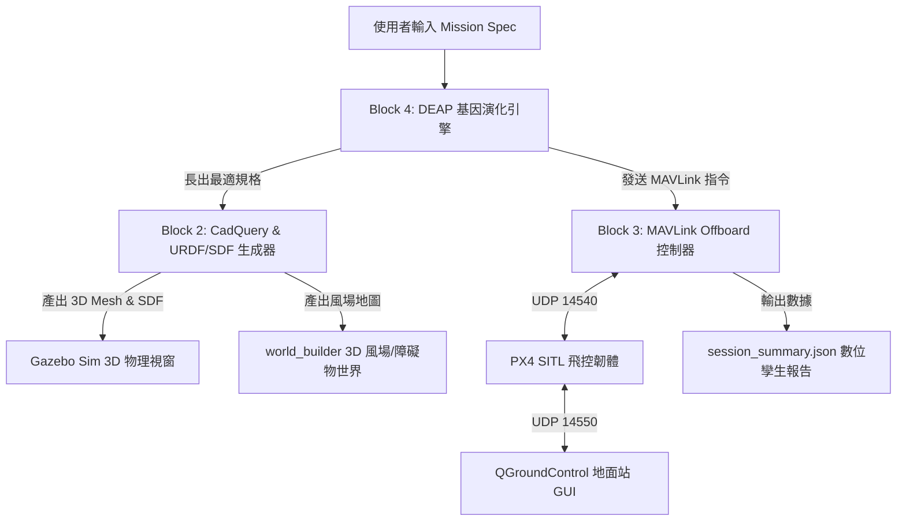

# 📖 數位孿生無人機系統 - 使用者操作與系統運行工作手冊 (Operational User Manual)

本手冊為「**任務導向數位孿生無人機形態長成與 MAVLink 自主飛控系統 (Digital Twin Drone MVP)**」的標準操作指南 (SOP)。說明如何安裝環境、設定任務 Prompt、啟動 3D 物理渲染視窗、連接 QGroundControl 地面站 GUI 並導出數位孿生報告。

---

## 🏛️ 1. 系統架構與開源工具鏈 (Architecture Overview)

本系統採用全開源、鬆散耦合的數位孿生閉環架構：



---

## 🛠️ 2. 環境需求與一鍵安裝指南 (Prerequisites & Installation)

### 基礎環境
- **作業系統**：macOS (Apple Silicon / Intel) 或 Linux (Ubuntu 22.04 LTS)
- **程式語言**：Python 3.10+

### Step 1: 安裝 3D 物理渲染視窗 (Gazebo Sim)
- **macOS (Homebrew)**：
  ```bash
  brew install gz-sim
  ```
- **Ubuntu Linux**：
  ```bash
  sudo apt update && sudo apt install -y ros-humble-ros-gz
  ```

### Step 2: 安裝 QGroundControl 無人機地面站 UI (可選，推薦)
- 前往官方網站下載並安裝：[QGroundControl Download Guide](https://qgroundcontrol.com/)
- QGroundControl 將在啟動時自動透過 **UDP 端口 14550** 連線並顯示 3D 人工姿態儀 (Attitude Horizon)、動態地圖與電量感測數據。

---

## 🚀 3. 快速啟動與操作指南 (Step-by-Step Operating Guide)

切換至專案根目錄：
```bash
cd "/Users/jasonzheng/Documents/Obsidian workspace/AI agent workspace/Digital_Twin_Drone_MVP"
```

### 🔍 步驟 A：環境檢測與相容性排查
在啟動程式前，可先執行環境診斷腳本：
```bash
python3 check_gui_env.py
```
*系統將會檢查 `gz` (Gazebo 3D 引擎)、`PX4 SITL` 與 `QGroundControl` 是否已在系統中就緒。*

---

### 🎮 步驟 B：互動式 CLI 主程式啟動 (推薦)
執行 CLI 主控選單，系統將展示預設任務：
```bash
python3 cli.py
```
或直接輸入任務代號執行：
```bash
# 執行任務 1：橋樑/管道狹窄空間避障巡檢
python3 cli.py 1

# 執行任務 2：海上風電高風速長航程巡航
python3 cli.py 2

# 執行任務 3：醫療物資重載緊急運輸
python3 cli.py 3
```

---

### 🖥️ 步驟 C：單獨啟動 3D Gazebo 物理視窗與地圖
若您想單獨加載特定的無人機 3D SDF 模型與風場 `.world` 地圖：
```bash
./launch_simulation.sh output/evolved_confined_space.sdf output/world_bridge_confined_inspection.world
```

---

### 🧪 步驟 D：執行端到端自動化閉環與單元測試
運行全套自動化測試以驗證系統健康度：
```bash
# 執行端到端閉環模擬
python3 run_mvp_pipeline.py

# 執行單元測試套件
python3 test_db_loader.py
python3 test_drone_builder.py
python3 test_mavlink_controller.py
python3 test_morph_evolution.py       # 驗證演化決策動機、血統溯源與報表導出
python3 test_run_mvp_pipeline.py
python3 test_next_phase.py
python3 test_choice_1.py
python3 test_choice_2.py
python3 test_choice_3.py
python3 test_webgl_environments.py
```

### 🧬 步驟 D-2：形態演化溯源與變遷原因報告 (Evolutionary Lineage & Explainability)
在每次形態演化或執行 `python3 run_mvp_pipeline.py` 時，系統會自動在 `output/` 輸出完整的演化溯源報告：
- **`output/evolution_lineage_report.md`**：完整 Markdown 格式溯源報告，包含任務約束、最佳形態規格、世代躍遷決策歷史、變革物理動機日誌、結構化決策矩陣與物理約束檢核清單。
- **`output/evolution_history.json`**：完整結構化 JSON 歷史數據，記錄每一代最大/平均適應度、世代突破點、血統系譜鏈與 `morph_decisions`。
- **變遷動機範例**：
  * 「縮短機臂長度 (0.35m -> 0.17m)：因空間限制直徑超標 (原 0.85m > 0.50m)，消除約束懲罰 (-300)」
  * 「升級 6S 5000mAh 電池：原續航 7.8min 未達任務門檻 (10.0min)，獲得續航加成 (+85.0 分)」
  * 「更換 2212 920KV 馬達 + 1045 槳：原推重比 TWR=1.45 低於安全下限 (1.5)，改善後 TWR=2.15 進入最佳區間 (+30 分)」


### 🎮 步驟 E：3D WebGL 網頁鍵盤親自試飛與物理碰撞 (Flight Test Simulator)
您可以直接在 Safari / Chrome 瀏覽器中開啟 **[flight_test_simulator.html](file:///Users/jasonzheng/Documents/Obsidian%20workspace/AI%20agent%20workspace/Digital_Twin_Drone_MVP/output/flight_test_simulator.html)**，直接用鍵盤親自駕駛長出的無人機：

- **飛行按鍵控制**：
  - <kbd>W</kbd> / <kbd>S</kbd>：俯仰 (前後傾斜飛行)
  - <kbd>A</kbd> / <kbd>D</kbd>：翻滾 (左右傾斜飛行)
  - <kbd>↑</kbd> / <kbd>↓</kbd>：油門 (增加/減少推力上升降落)
  - <kbd>←</kbd> / <kbd>→</kbd>：偏航 (旋轉方向)
  - <kbd>Space</kbd>：緊急懸停
  - <kbd>R</kbd>：**一鍵快速維修與機身重置 (Repair & Reset)**
- **💥 撞擊動態破損模擬系統 (Crash & Structural Damage Simulation)**：
  - **撞擊動能檢測與局部破損**：當無人機以高速撞擊建築大樓、風機塔身、防撞立柱或地面時，根據接觸點方位精確損壞對應機臂與旋翼（機臂折損斷裂、碳纖維焦黑碎裂紋理、斷槳剪切縮放、馬達傾角脫位）。
  - **火花與碳纖維碎片飛散 (Sparks & Debris Particles)**：撞擊瞬間於接觸點噴發 50+ 顆高溫火花粒子與 8 塊旋轉彈跳碳纖維碎屑，伴隨鏡頭猛烈撞擊震顫。
  - **結構健康 HUD 與 BOM 實時警示**：HUD 即時更新「機身結構完整度 %」進度條與受損部件列表；右側 BOM 面板即時高亮標註斷裂機臂管與斷槳組件，推重比 (TWR) 同步崩跌。
  - **非對稱物理失衡與失控翻滾**：若機臂或旋翼受損，將引發推進力矩失衡、機身劇烈機械抖動；若完整度低於 20% 則進入致命失速螺旋（Spin of Death）失控旋轉墜毀。
  - **一鍵快速維修 (Repair & Reset)**：點擊 HUD「🛠️ 維修與重置」或鍵盤按下 <kbd>R</kbd>，100% 修復機身網格、清除飛散碎片並重置至標準出廠飛行狀態。
- **🌐 測試情境環境即時切換 (Scene Environments)**：
  - 在 HUD 介面下拉選單中可即時無縫切換 4 大任務情境：
    1. **🌊 離岸風場巡檢 (Offshore Wind Farm)**：動態海面水波、巨大旋轉風力發電機群、海面警告浮標與 4.5 m/s 強海風。
    2. **🏙️ 城市高樓搜救 (Urban City Search & Rescue)**：現代摩天大樓群、樓頂搜救目標閃爍紅光信標、貨櫃路障與大樓街道亂流。
    3. **⚡ 碰撞測試場地 (Collision Arena)**：防撞包覆網格圍欄、螢光穿越賽道框 (FPV Gates)、警示條紋障礙立柱與室內零風速風洞。
    4. **🌙 夜間紅外線巡檢 (Night Thermal/Inspection)**：暗黑高對比夜間視角、機載前向強光探照燈、變壓器散熱鰭片與過熱異常管線 (FLIR LWIR 8-14μm 熱成像 HUD 焦點溫標)。
- **📹 飛航遙測與操作示範數據錄製系統 (Flight Data Recorder for Imitation/RL Training)**：
  - **2Hz 輕量高精度特徵取樣 (State-Action Pairs, 500ms 間隔)**：在試飛過程中按 <kbd>G</kbd> 或點擊 HUD「🔴 開始錄製」即可即時紀錄高精準飛航遙測，降低龐大數據負擔：
    * `step` / `timestamp` / `iso_time`
    * `state`：3D 空間位置 [x, y, z]、線速度 [vx, vy, vz]、姿態弧度/角度 [roll, pitch, yaw]、角速度 [wx, wy, wz]、機體結構完整度 `integrity`、鋰電池電壓與受損部件列表
    * `action`：操縱鍵盤信號（俯仰 `pitch_cmd`、滾轉 `roll_cmd`、偏航 `yaw_cmd`、升力 `climb_cmd`、自動懸停旗標）
    * `environment`：當前環境 ID、即時風場向量 [wx, wy, wz]、撞擊剛體事件與精確撞擊接觸點座標
  - **UI 狀態指示與靜默自動保存**：錄製時 HUD 顯示紅點呼吸閃爍、錄製碼表與即時樣本採集數 (`Samples: xxx`)；停止錄製後系統自動將訓練數據寫入 LocalStorage 本地儲存庫並靜默備份，移除繁瑣的手動下載步驟。
- **📝 重置前飛行經驗回饋 (Pilot Experience & Reset Feedback)**：
  - 按下 <kbd>R</kbd> 或點擊「🛠️ 維修與重置」時，系統會彈出簡潔的「飛行經驗回饋對話框」，提供純文字輸入框供自由填寫飛行心得、操控體驗或重置原因，點擊「確定重置並保存」即自動整合進訓練集供後續自主飛行 AI 經驗學習。

---

## 📝 4. 自訂任務設定檔說明 (Custom Mission Profiles)

您可以編輯 `mission_profiles.json` 加入自訂的任務需求 Prompt：

```json
{
  "id": "my_custom_mission",
  "name": "高空建築外牆檢測任務",
  "mission_type": "high_rise_inspection",
  "max_size_m": 0.65,
  "min_flight_time_min": 15.0,
  "target_payload_g": 300,
  "required_sensors": ["s_lidar_2d", "s_depth_cam", "s_opt_cam_hd"],
  "wind_velocity_xyz": [4.0, 1.5, 0.0],
  "obstacles": [
    { "type": "box", "pos": [3.0, 0.0, 2.0], "size": [1.0, 0.5, 4.0] }
  ]
}
```

---

## 📊 5. 產出檔案結構說明 (Outputs & Session Reports)

所有產出的 3D 模型與遙測報告均存放在 `output/` 資料夾：

| 檔案名稱 | 說明 |
| :--- | :--- |
| `evolved_<mission>.urdf` | 演化長出之無人機 URDF 向量結構與慣性張量描述檔 |
| `evolved_<mission>.sdf` | Gazebo 相容之 SDF 物理模型檔 (含馬達與感測器 Plugin) |
| `world_<mission>.world` | 含風力向量 (Wind System) 與障礙物陣列之 3D 模擬場景 |
| `session_summary_<mission>.json` | 包含演化幾何、感測視場覆蓋率 (FOV) 與 MAVLink Telemetry 紀錄 |

---

## ❓ 6. 常見問題與故障排查 (Troubleshooting Q&A)

### Q1: 執行 `python3 cli.py` 時提示 "Address already in use (UDP 14540/14550)"？
* **原因**：已有舊的 MAVLink 或 PX4 SITL 實例背景行程正在佔用端口。
* **解法**：在 Terminal 中清除舊進程：
  ```bash
  pkill -f px4 || true
  pkill -f gz || true
  ```

### Q2: QGroundControl 無法自動連線？
* **原因**：請確認 `cli.py` 或 `launch_simulation.sh` 已啟動，並確認通訊埠 **UDP 14550** 未被防火牆阻擋。

---

*手冊維護者：AI Agent (Antigravity)*  
*最後更新日期：2026-09-18*
