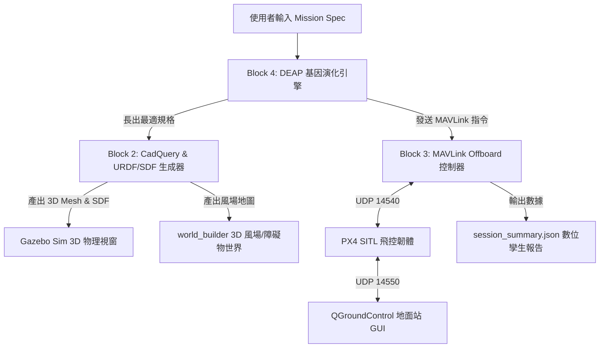

# 📖 數位孿生無人機系統 - 使用者操作與系統運行工作手冊 (Operational User Manual)

本手冊為「**任務導向數位孿生無人機形態長成與 MAVLink 自主飛控系統 (Digital Twin Drone MVP)**」的標準操作指南 (SOP)。說明如何安裝環境、設定任務 Prompt、啟動 3D 物理渲染視窗、連接 QGroundControl 地面站 GUI 並導出數位孿生報告。

---

## 🏛️ 1. 系統架構與開源工具鏈 (Architecture Overview)

本系統採用全開源、鬆散耦合的數位孿生閉環架構：



---

## 🛠️ 2. 環境需求與一鍵安裝指南 (Prerequisites & Installation)

### 基礎環境
- **作業系統**：macOS (Apple Silicon / Intel) 或 Linux (Ubuntu 22.04 LTS)
- **程式語言**：Python 3.10+

### Step 1: 安裝 3D 物理渲染視窗 (Gazebo Sim)
- **macOS (Homebrew)**：
  ```bash
  brew install gz-sim
  ```
- **Ubuntu Linux**：
  ```bash
  sudo apt update && sudo apt install -y ros-humble-ros-gz
  ```

### Step 2: 安裝 QGroundControl 無人機地面站 UI (可選，推薦)
- 前往官方網站下載並安裝：[QGroundControl Download Guide](https://qgroundcontrol.com/)
- QGroundControl 將在啟動時自動透過 **UDP 端口 14550** 連線並顯示 3D 人工姿態儀 (Attitude Horizon)、動態地圖與電量感測數據。

---

## 🚀 3. 快速啟動與操作指南 (Step-by-Step Operating Guide)

切換至專案根目錄：
```bash
cd "/Users/jasonzheng/Documents/Obsidian workspace/AI agent workspace/Digital_Twin_Drone_MVP"
```

### 🔍 步驟 A：環境檢測與相容性排查
在啟動程式前，可先執行環境診斷腳本：
```bash
python3 check_gui_env.py
```
*系統將會檢查 `gz` (Gazebo 3D 引擎)、`PX4 SITL` 與 `QGroundControl` 是否已在系統中就緒。*

---

### 🎮 步驟 B：互動式 CLI 主程式啟動 (推薦)
執行 CLI 主控選單，系統將展示預設任務：
```bash
python3 cli.py
```
或直接輸入任務代號執行：
```bash
# 執行任務 1：橋樑/管道狹窄空間避障巡檢
python3 cli.py 1

# 執行任務 2：海上風電高風速長航程巡航
python3 cli.py 2

# 執行任務 3：醫療物資重載緊急運輸
python3 cli.py 3
```

---

### 🖥️ 步驟 C：單獨啟動 3D Gazebo 物理視窗與地圖
若您想單獨加載特定的無人機 3D SDF 模型與風場 `.world` 地圖：
```bash
./launch_simulation.sh output/evolved_confined_space.sdf output/world_bridge_confined_inspection.world
```

---

### 🧪 步驟 D：執行端到端自動化閉環與單元測試
運行全套自動化測試以驗證系統健康度：
```bash
# 執行端到端閉環模擬
python3 run_mvp_pipeline.py

# 執行單元測試套件
python3 test_db_loader.py
python3 test_drone_builder.py
python3 test_mavlink_controller.py
python3 test_morph_evolution.py
python3 test_next_phase.py
python3 test_choice_3.py
```

### 🎮 步驟 E：3D WebGL 網頁鍵盤親自試飛與物理碰撞 (Flight Test Simulator)
您可以直接在 Safari / Chrome 瀏覽器中開啟 **[flight_test_simulator.html](file:///Users/jasonzheng/Documents/Obsidian%20workspace/AI%20agent%20workspace/Digital_Twin_Drone_MVP/output/flight_test_simulator.html)**，直接用鍵盤親自駕駛長出的無人機：

- **飛行按鍵控制**：
  - <kbd>W</kbd> / <kbd>S</kbd>：俯仰 (前後傾斜飛行)
  - <kbd>A</kbd> / <kbd>D</kbd>：翻滾 (左右傾斜飛行)
  - <kbd>↑</kbd> / <kbd>↓</kbd>：油門 (增加/減少推力上升降落)
  - <kbd>←</kbd> / <kbd>→</kbd>：偏航 (旋轉方向)
  - <kbd>Space</kbd>：緊急懸停
- **實時 HUD 與碰撞物理**：
  - 畫面上方實時顯示高度 (m)、速度 (m/s)、電量 (V) 與風場矢量。
  - 當撞擊 Gazebo `.world` 障礙物牆體時，會觸發 3D 剛體反彈與撞擊警告。

---

## 📝 4. 自訂任務設定檔說明 (Custom Mission Profiles)

您可以編輯 `mission_profiles.json` 加入自訂的任務需求 Prompt：

```json
{
  "id": "my_custom_mission",
  "name": "高空建築外牆檢測任務",
  "mission_type": "high_rise_inspection",
  "max_size_m": 0.65,
  "min_flight_time_min": 15.0,
  "target_payload_g": 300,
  "required_sensors": ["s_lidar_2d", "s_depth_cam", "s_opt_cam_hd"],
  "wind_velocity_xyz": [4.0, 1.5, 0.0],
  "obstacles": [
    { "type": "box", "pos": [3.0, 0.0, 2.0], "size": [1.0, 0.5, 4.0] }
  ]
}
```

---

## 📊 5. 產出檔案結構說明 (Outputs & Session Reports)

所有產出的 3D 模型與遙測報告均存放在 `output/` 資料夾：

| 檔案名稱 | 說明 |
| :--- | :--- |
| `evolved_<mission>.urdf` | 演化長出之無人機 URDF 向量結構與慣性張量描述檔 |
| `evolved_<mission>.sdf` | Gazebo 相容之 SDF 物理模型檔 (含馬達與感測器 Plugin) |
| `world_<mission>.world` | 含風力向量 (Wind System) 與障礙物陣列之 3D 模擬場景 |
| `session_summary_<mission>.json` | 包含演化幾何、感測視場覆蓋率 (FOV) 與 MAVLink Telemetry 紀錄 |

---

## ❓ 6. 常見問題與故障排查 (Troubleshooting Q&A)

### Q1: 執行 `python3 cli.py` 時提示 "Address already in use (UDP 14540/14550)"？
* **原因**：已有舊的 MAVLink 或 PX4 SITL 實例背景行程正在佔用端口。
* **解法**：在 Terminal 中清除舊進程：
  ```bash
  pkill -f px4 || true
  pkill -f gz || true
  ```

### Q2: QGroundControl 無法自動連線？
* **原因**：請確認 `cli.py` 或 `launch_simulation.sh` 已啟動，並確認通訊埠 **UDP 14550** 未被防火牆阻擋。

---

*手冊維護者：AI Agent (Antigravity)*  
*最後更新日期：2026-09-18*
